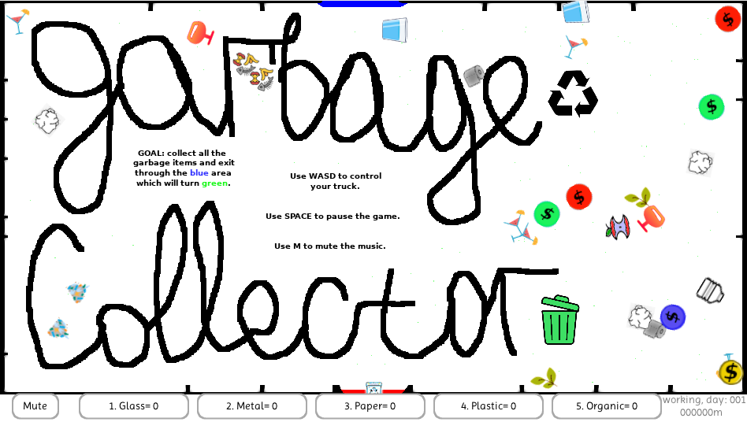

\# Description
*Event: https://ldjam.com/events/ludum-dare/58*
*Starts: Saturday October 4th; starts at 1:00 AM EEST*
*Ends: Monday at 1:00 AM EEST*
*Theme: Collector*
*Format: The Compo - 48 hour deadline, solo, from scratch (as much as is reasonable), and share your source code.*

## Screenshot:

## Used resources:
* The V programming language from https://github.com/vlang/v
* Imprima-Regular.ttf from https://www.1001freefonts.com/imprima.font
* mazes from https://www.mazegenerator.net/
* Song from https://suno.com/
